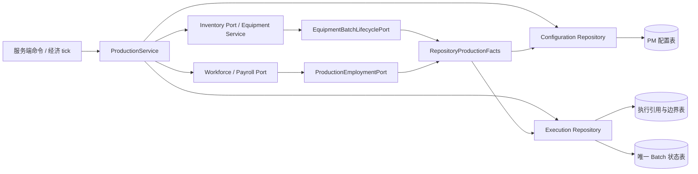

# 生产代码阅读地图

本图对应 [ADR-PO-02](../../architecture/adr/ADR-PO-02.md) 的双聚合实现。领域职责见 [概览](overview.md)；[包迁移审计](package-refactoring.md) 和 [第二轮解耦审计](context-decoupling-review.md) 是历史记录，不能用其中的旧建筑 checkpoint 描述推断当前所有权。

## 1. 权威对象与入口

主源码前缀：`src/main/java/com/bbmurloc/victoriaeconomics/server/`。

```text
building/          建筑身份、类型、运营状态；不持有生产聚合
production/
  domain/          独立配置与执行聚合、执行内部 Batch、配方与选人计算
  application/     联合初始化、开工/推进/结算/边界恢复协调、逻辑时钟、统计查询
  port/            独立 Repository，库存/用工/工资事实与恢复日志契约
  infrastructure/  两个 SQLite Repository、开工 Journal、对库存和任职提供的事实适配器
inventory/
  domain/          单地点商品库存、独立设备持有、设备请求与结果
  application/     设备变更与跨地点保存协调、设备索引
  port/            库存拥有的设备批次生命周期查询契约
  infrastructure/  SQLite 商品地点与设备持有适配器
workforce/employment/  正式任职与岗位 Reservation 权威、生产保护查询契约
storage/sqlite/    初始 Schema、共享事务、建筑身份与任职存储
```

| 职责 | 优先阅读 | 当前边界 |
| --- | --- | --- |
| 方法配置根 | [ProductionMethodConfiguration](../../../src/main/java/com/bbmurloc/victoriaeconomics/server/production/domain/ProductionMethodConfiguration.java) | buildingId、Effective、唯一 Pending、configurationRevision / effectiveRevision；独立保存。 |
| 执行根 | [ProductionExecution](../../../src/main/java/com/bbmurloc/victoriaeconomics/server/production/domain/ProductionExecution.java) | buildingId、current/last Batch、边界、自动运行、executionRevision、已协调的 Effective 版本。 |
| 批次实体和承诺 | [ProductionBatch](../../../src/main/java/com/bbmurloc/victoriaeconomics/server/production/domain/ProductionBatch.java)、[ProductionBatchConfiguration](../../../src/main/java/com/bbmurloc/victoriaeconomics/server/production/domain/ProductionBatchConfiguration.java) | 固定配方、PM 版本、设备能力和人员；只由执行聚合推进生命周期。 |
| 独立存储 | [配置 Repository](../../../src/main/java/com/bbmurloc/victoriaeconomics/server/production/infrastructure/SqliteProductionMethodConfigurationRepository.java)、[执行 Repository](../../../src/main/java/com/bbmurloc/victoriaeconomics/server/production/infrastructure/SqliteProductionExecutionRepository.java) | 分别 CAS 保存；执行与 Batch 一个事务，Batch 表是唯一可变记录。 |
| 应用协调 | [ProductionService](../../../src/main/java/com/bbmurloc/victoriaeconomics/server/production/application/ProductionService.java) | 同一经济写锁中读取最新事实；独立提交、补偿、确认未知结果及恢复边界。没有可变生产 Registry。 |
| 联合初始化 | [ProductionBuildingInitializer](../../../src/main/java/com/bbmurloc/victoriaeconomics/server/production/application/ProductionBuildingInitializer.java) | 一个 SQLite 事务创建建筑、配置和空执行；失败不发布建筑索引。 |
| 领域计算 | [ProductionRecipeResolver](../../../src/main/java/com/bbmurloc/victoriaeconomics/server/production/domain/ProductionRecipeResolver.java)、[WorkforcePlanningService](../../../src/main/java/com/bbmurloc/victoriaeconomics/server/production/domain/WorkforcePlanningService.java) | 固定定义、正式任职事实、资格、设备上限、10% 门槛与瓶颈最少整数人数；无 Minecraft / SQL 依赖。 |
| 外部保护事实 | [RepositoryProductionFacts](../../../src/main/java/com/bbmurloc/victoriaeconomics/server/production/infrastructure/RepositoryProductionFacts.java) | 对任职提供 PM 职业容量及参产保护；对库存核验已提交 EQUIPMENT 边界、Batch 和 PM 版本。 |
| 商品库存 | [GoodsInventory](../../../src/main/java/com/bbmurloc/victoriaeconomics/server/inventory/domain/GoodsInventory.java) | 单地点数量、整批 Reservation、容量、比例结算、持久化幂等回执；生产端口只返回必要查询和回执。 |
| 设备库存 | [ProductionEquipmentHolding](../../../src/main/java/com/bbmurloc/victoriaeconomics/server/inventory/domain/ProductionEquipmentHolding.java) | 独立统一设备容量、安装/未安装、保护所有者、延期请求及锁定。 |
| 设备应用 | [ProductionEquipmentService](../../../src/main/java/com/bbmurloc/victoriaeconomics/server/inventory/application/ProductionEquipmentService.java) | 保存成功才更新索引；flush 通过库存拥有的生命周期 Port 校验，不能沿 Building 进入生产内部对象。 |
| 统计查询 | [StaffingCalculator](../../../src/main/java/com/bbmurloc/victoriaeconomics/server/production/application/StaffingCalculator.java) | 从独立配置读取配方；HR 目标作为输入，默认满配；结果不授予开工许可。 |



## 2. PM 命令：独立提交与边界重入

`/ve production <UUID> pm|cancel_pm` → `ProductionService.selectProductionMethod()/cancelPendingProductionMethods()`。

`trustworthyExecution()` 先核实该建筑未清理 StartIntent 的提交证据，并独立加载 Execution。无法确认执行保护或 Batch 提交结果时拒绝 PM；明确未提交但尚有待释放资源的 StartIntent 不阻止 PM，只阻止新开工。

配置聚合校验完整目标，依据可信执行状态立即生效或替换唯一 Pending。实际变化先通过配置 Repository 独立提交。活动/暂停/待结算批次的 Pending 保存不需要执行写入，即使执行进度保存刚失败也能提交。

批次已经结束但边界未完成时，Pending 提交后再独立保存执行重入 METHODS；后一个保存失败不会撤销前一个配置提交。下一次恢复检查 Pending 与 Effective 版本，主动重入 METHODS。空闲 PM 立即生效后立即尝试必要人事协调；人事或执行检查点失败保留新 PM，禁止未经重新核验的新批次。

## 3. 开工：正式提交点

[ProductionCommands](../../../src/main/java/com/bbmurloc/victoriaeconomics/server/command/ProductionCommands.java) 的 `start` 和启用自动生产后的经济 tick 均调用 `ProductionService.startBatch()`。

1. 同一经济写锁中读取 Execution，拒绝未清理开工意图和旧 Batch/边界；检查独立 PM 版本与必要人事协调。
2. `prepare()` 读取建筑运营、CURRENT 工资、库存容量、设备、Effective PM、全部有效正式任职及资格；固定配方、Effective 版本、设备与最少参产安排。
3. `ProductionJournal.recordStart()` 保存意图，再由 Inventory 整批排他锁料和设备聚合取得保护，库存地点为本建筑 UUID。
4. 提交前重新核验配置、设备、任职、资格、工资、必要人事状态、材料锁定和执行 revision。职业容量统计全部有效正式任职，不能靠资格过滤隐藏超员。
5. `ProductionExecution.start()` 创建内部 Batch，`ProductionExecutionRepository.save()` 原子提交执行引用与唯一 Batch 行。**这个事务成功才是正式开工**，不再保存整份建筑。
6. 清理意图失败可以重试。开工异常先查询真实 Batch 表：确认提交则只重读 Execution，保留承诺且不覆盖独立 PM；确认未提交则补偿释放；核实失败保留资源并拒绝依赖提交结果的 PM 操作。

[SqliteTransactions](../../../src/main/java/com/bbmurloc/victoriaeconomics/server/storage/sqlite/SqliteTransactions.java) 区分版本冲突、已回滚失败和提交结果未知。权威查询要求 JDBC 已回到自动提交状态，避免将未提交连接视图作为真实提交证据；连接状态未恢复时等待重新可核实或重启。

## 4. 推进与结算

`ServerLifecycleEvents.onServerTick(Post)` → `ServerEconomyContext.onServerTick()` → `EconomicClock.onServerTick()` → `ProductionService.onEconomicTick()` → `ProductionExecution.tick(1)`。

满速仍为 1200 个逻辑 tick，不依赖 Level、Chunk、BlockEntity、GUI 或墙上时间，不离线补算。工资 CURRENT 恢复原 Batch，ARREARS 提交不可逆比例终止，其余状态暂停。执行 Repository 单独保存进度，不写 PM 配置。

正常完成进入 SETTLING_COMPLETED；`stop` 或补救失败进入 SETTLING_ABORTED。终止状态成功提交后不得恢复 ACTIVE 或改变用于结算的历史进度。

`settleAndHandleBoundary()` 通过 [SqliteInventoryStore](../../../src/main/java/com/bbmurloc/victoriaeconomics/server/inventory/infrastructure/SqliteInventoryStore.java) 对固定材料/产品及实际进度结算；Inventory 原子保存扣料、产出、剩余锁释放和回执。相同 Batch 重试不重复扣料/产出，合法批次完工允许首次超容；普通入库和新开工继续受容量限制。

库存成功后 Execution 确认 Batch 真正结束并保存 METHODS。此保存失败时，库存回执支持重试。暂停后的恢复 tick 可以同时达到满进度；Repository 接受该受控恢复到结算的组合变化。

## 5. METHODS → EQUIPMENT → WORKFORCE

每步重新读取两个独立根，不能把先前就绪快照当作永久许可。

- **METHODS**：独立 `applyPending()` / 配置保存 → 立即尝试用工再配置 → `methodsApplied(effectiveRevision)` / 执行保存。允许新 Effective 已保存而执行仍在 METHODS；重试不重新产生配置变化。
- **EQUIPMENT**：检查 Pending 为空、执行已协调的 Effective 版本等于当前配置版本；`EquipmentBatchLifecyclePort` 核验已经持久化的正确 Batch/边界后，释放保护并按请求顺序执行、保存设备；随后独立保存执行边界。
- **WORKFORCE**：再次对最新 Effective 职业容量协调 Reservation 和真实任职。必要公司调任/同意/解雇尚未完成时停留在此处，不伪造完成。成功后保存 lastBatch、清空 currentBatch 和边界。
- 任意 EQUIPMENT/WORKFORCE 入口发现新 Pending 或 Effective 版本差异，先保存重入 METHODS。失败仍保留旧边界和新配置供下次主动发现。
- 自动下一批在后续 tick 重新评估；手动开工也必须完成必要人事核验。其他建筑或与当前调整无关的人事事项不构成全局阻塞。

`methods_effective_revision` 只是执行协调检查点，不包含 PM 选择，也不取代 Configuration 的 Effective 权威。

设备安装/卸载、排他安装 Reservation、部分执行/取消、统一总容量、两地点调拨和请求幂等保持原算法。活动、暂停、两种 SETTLING、未知执行/PM、错误 Batch、旧 Batch 授权一律不能通过 flush；设备保护已空也不能跳过生产边界核验。

## 6. 初始存档与启动恢复

新库由 [EconomySchema](../../../src/main/java/com/bbmurloc/victoriaeconomics/server/storage/sqlite/EconomySchema.java) 建立版本 2：

| 表 | 唯一权威内容 |
| --- | --- |
| economic_buildings | 建筑身份、类型、运营状态。 |
| production_method_configurations | Effective/Pending JSON、配置总 revision、Effective revision。 |
| production_executions | current/last Batch ID、边界、自动运行、执行 revision、已协调的 Effective revision；不存 Batch JSON。 |
| production_batches | 不可变配置快照（含 Effective revision）、进度和状态；当前及历史 Batch 单一记录。 |
| production_start_intents | 可补偿开工意图，一个建筑最多一条。 |
| inventory_locations / equipment_holdings / employment_state | 保留各上下文原有业务状态 JSON。 |

执行引用使用带 buildingId 的延迟外键；未结束 Batch 的部分唯一索引阻止并行批次。执行引用和 Batch 行在同一事务内保存，配置 CAS 独立。建筑初始化可以联合事务创建三个独立根。

[ServerEconomyContext](../../../src/main/java/com/bbmurloc/victoriaeconomics/server/ServerEconomyContext.java) 先加载建筑并校验独立配置/执行，恢复设备、任职并装配服务，再调用 `recoverStarts()` 和 `recoverBoundaries()`，最后接入时钟。关闭自动生产的空闲建筑也会重新核验最新 PM 和必要人事事项；活动 Batch 不重新选人或锁料。

`retry` 先恢复开工意图再恢复该建筑边界；经济 tick 持续重试。版本/加载/提交结果不可信时保持资源保护，日志记录建筑或 Batch 身份。

版本、表或列不兼容的旧库明确拒绝并提示另用新世界，不迁移、不清空、不 DROP。旧 `ProductionDepartment`、`ProductionStateCodec` 与设备余额迁移入口已经移除。

## 7. 测试与实际限制

领域测试：`ProductionDomainTest`、`InventoryAndEquipmentTest`。

真实临时 SQLite：`ProductionRepositoryTest`、`BuildingProductionIsolationTest`、`StartCommitRecoveryTest`、`BoundaryRecoveryTest`、既有生产集成/恢复/用工/库存契约测试。

工资与资格成功事实只在测试装配中明确提供。正式 `ServerEconomyContext` 默认工资 UNAVAILABLE、资格 false；真实工资付款、公司调任/NPC 同意及完整解雇流程仍由对应上下文补齐。没有将这些结果伪造成成功。

验证计数和命令见 [ADR 实施记录](../../architecture/adr/ADR-PO-02.md#10-实施记录2026-10-09)。本轮没有启动 Minecraft 服务端，JUnit/SQLite 和打包成功不能代替游戏内验收。
