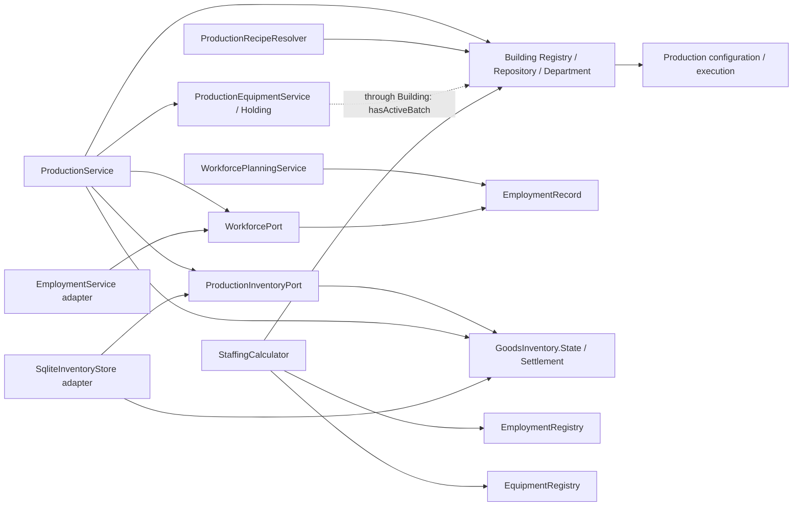
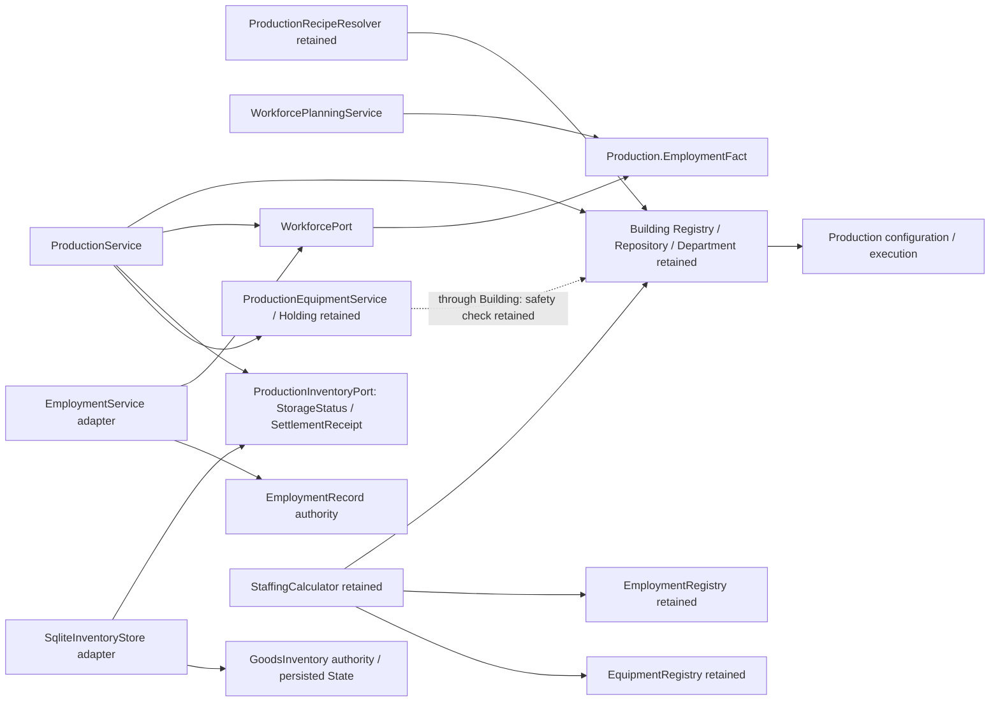

# 第二轮 DDD 审计：Production Operations 跨上下文契约

> 历史记录：本文对应 `ef94beb` 到 `01a8c0a` 的第二轮契约解耦，保留当时证据与 A/B 建议。后续用户已经通过 [ADR-PO-02](../../architecture/adr/ADR-PO-02.md) 确认 B′，当前已实现独立生产 Repository、全新初始 Schema 和生命周期事实 Port。现行入口见 [代码阅读地图](code-reading-map.md)；本文的“本轮不实施”及联合建筑 checkpoint 描述仅指当时任务，不代表当前代码。

2026-10-09。本轮以本地实际源码和 [领域概览](overview.md)、[阅读地图](code-reading-map.md)、[第一轮包迁移审计](package-refactoring.md) 为依据。本文记录实现与建议，不改变概览中已确认的聚合结论。设备协议和 ProductionSite 均为待评审建议，本轮没有实施。

## 基线与修改范围

- 本地 `main` / HEAD / 跟踪的 `origin/main` 均为 `ef94beb67f48c3ce7872f17f800b8b35f8127b2d`。开始时工作区、暂存区均干净。
- `origin` 是 VE 本体 `https://github.com/rudin233/victoria-economics.git`。日志依次包含 `ef94beb`、`465b2ec`、`f94642b`，以第二轮基线继续，未重复实施旧远程审计中的功能。
- `git ls-remote origin refs/heads/main` 因 GitHub TLS 连接失败未成功，不能据本地跟踪引用声称已实时确认远端。
- 仅重构用工事实和商品库存端口；保留正式任职、工资、库存和设备各自的权威。经济算法、执行状态机、全局写锁、事务、Schema、JSON DTO 和命令协议不变。
- 没有提交、push、创建 PR，也没有改动三份既有领域文档。

## 依赖审计

下表区分**事实消费**、**对具体实现/对象图的依赖**与**适配器依赖消费者契约**。后者是正常的依赖倒置，不等于 Inventory 或 Employment 的领域模型反向依赖生产领域实现。通过 `Building → ProductionDepartment` 的间接调用同样计入审计，不能只数 import。

| 依赖 / 消费入口 | 谁拥有权威事实 | 穿透及反向依赖 | Port 判断、本轮处理与风险 |
| --- | --- | --- | --- |
| ProductionService → BuildingRegistry / EconomicBuilding / BuildingStatus | Building：身份、类型和运营状态；Production：PM 与执行 | 服务遍历建筑，并沿部门取得可变执行对象、方法 checkpoint，保存/恢复整个建筑。Building 又组合生产部门，形成双向实现依赖。 | 身份/运营查询可逐步收窄，但生产组合的所有权和保存必须一起设计；本轮保留。高风险：启动装配、恢复替换、创建/删除、保存失败回滚。 |
| ProductionService → BuildingRepository | 当前 repository 是组合 checkpoint；其中生产事实仍属于 Production | save/loadAll 同时处理建筑、有效/Pending PM、执行及历史；不是独立生产 Repository。 | 不能用返回整个建筑的空包装 Port 假装解耦。确定聚合方案后再拆持久化职责。高风险：丢失原子性或回滚一半状态。 |
| ProductionRecipeResolver.resolve(EconomicBuilding) → ProductionDepartment.getRecipe() | Production：有效方案与配方；Building：载体 | 领域服务依赖建筑对象图；该重载实际只是委托，固定定义构造路径使用 common.definition。BuildingService 也依赖 resolver 初始化配置。 | 后续可让调用方直接取得生产配方，移除桥接重载；固定定义不需要另造查询 Port。本轮保留，避免扩大接口迁移。中风险：现有统计调用路径。 |
| StaffingCalculator → EconomicBuilding / HR StaffingExpectation | Building：身份/类型；Employment & Compensation：嵌入建筑的 HR 目标设置 | 读取部门设置与当前配方，未修改聚合；仍依赖具体组合结构。 | 将来使用只读统计输入；本轮保留统计数值语义。中风险：误把 HR 招聘目标或 StaffingSnapshot 当作开工授权。 |
| ProductionService / ProductionInventoryPort → GoodsInventory.State / Settlement（修改前） | Inventory：地点数量、Reservation、容量、结算回执明细 | 虽为不可变快照，仍暴露完整内部存档形状；生产重构库存聚合检查容量。SqliteInventoryStore 又实现生产端口。 | 已消除：只返回 StorageStatus 和 SettlementReceipt。库存适配器对生产契约的依赖保留；Inventory domain 不依赖 Production。中风险：读到的状态不再验证、先回执后保存、错误改变重试含义；本轮仍加载并验证真实库存，再计算容量。 |
| ProductionService → ProductionEquipmentService.getHolding / protect / release / flush | Inventory：设备持有、锁定、请求和批次保护；Production：批次生命周期与边界顺序 | getHolding 返回聚合副本，无法修改索引权威，但仍暴露设备聚合 API。flush 又经 Building 读取生产状态。 | 未来可收窄到 installed/capacity/pending 的能力事实及保护/边界命令；先设计边界授权协议。本轮保留。高风险：活动/暂停/待结算期提前改变能力或错误释放新批次保护。 |
| StaffingCalculator → ProductionEquipmentRegistry.getInstalledQuantity | Inventory：已保存设备数量 | 只读标量查询，但依赖具体索引实现；不穿透修改聚合。 | 有独立演进需要时收窄查询即可，不必现在创建全套设备接口。低到中风险：查询默认零值与已保存副本语义。 |
| WorkforcePlanningService / WorkforcePort → EmploymentRecord（修改前） | Employment：有效正式任职；资格由其配置的权威查询提供 | record 没有可变内部对象，但生产领域被其具体类型绑定；EmploymentService 已实现 WorkforcePort。 | 已改为生产拥有的 EmploymentFact，只在现有 EmploymentService 适配方法中转换。算法与资格查询保持不变。中风险：过滤不合格员工导致隐蔽超员、改变正式职业、重复 NPC。 |
| ProductionService → WorkforcePort.qualified / reconcile | Employment：资格、岗位 Reservation、人事调整；Production：配方职业需求 | 端口已有最小 boolean / demand Map，未暴露岗位预留和任职可变对象。EmploymentService.reconcile/fire 又经 Building 查询批次保护。 | 保留已存在的契约及反向生命周期事实消费；不能把人事协调复制到生产。高风险：过早解雇参产员工、将尚未实现的调任/NPC 同意当作成功。 |
| StaffingCalculator → EmploymentRegistry.count | Employment：正式任职权威与查询索引 | 公开只读计数，未修改集合；仍绑定具体 Registry。 | 本轮保留。后续查询 Port 必须保持当前计数，不能直接改成过滤资格/延期解雇后的 effectiveEmployment，否则统计语义变化。中风险。 |
| ProductionService → BuildingPayrollPort | Employment & Compensation：工资限制；Finance：实际付款 | 已是消费者拥有的最小状态契约，无工资账本或 Finance 对象泄漏。 | 保留 CURRENT/RECOVERY/ARREARS/UNAVAILABLE 与默认不可用行为。真实工资/资格/调任接入仍属原有依赖，不在本轮补全。 |
| Inventory.SqliteInventoryStore → ProductionInventoryPort | Inventory 仍拥有全部商品权威 | 基础设施适配器实现消费者端口，是正常的契约反向依赖；不从生产读取商品余额。 | 保留此依赖倒置；本轮新增 DTO 只作返回值，绝不写入 inventory state_json。风险在转换与确认时机，已做 SQLite 回归。 |
| Inventory.ProductionEquipmentService.flush → Building → ProductionDepartment.hasActiveBatch | Production：是否存在未真正结束的批次；Inventory：设备保护所有者 | 这是生产内部对象图的反向依赖，即使没有 Production import 也真实存在。 | 本轮不删安全检查、不改变协议。消除方案及恢复条件见下文。高风险。 |
| Building.EconomicBuilding / ProductionDepartment / BuildingService → Production 配置与执行 | Building：身份；Production：配置和执行 | 创建、持有、PM 变更与联合回滚构成当前组合边界；Production 同时消费 Building。 | 本轮保留，聚合方案评审后再迁移。高风险：将名称上的两个根误当成已独立加载、独立事务的聚合。 |

生产核心对 EmploymentRecord 和 GoodsInventory 的具体依赖已消除。`StaffingCalculator`、建筑组合、设备服务和恢复持久化仍有表中列出的保留耦合，不宣称整个 Production 上下文已经独立。

## 修改前后的代码依赖图

箭头表示源码/对象图依赖，非事件流。虚线表示间接生命周期调用。

修改前：



修改后：



## 实际契约与行为保持

用工事实在 [EmploymentFact](../../../src/main/java/com/bbmurloc/victoriaeconomics/server/production/domain/EmploymentFact.java)，转换在 [EmploymentService.effectiveEmployment](../../../src/main/java/com/bbmurloc/victoriaeconomics/server/workforce/employment/EmploymentService.java)。现有服务已经是适配器，无需新建另一个服务或 Registry。

```java
record EmploymentFact(UUID employeeId, UUID buildingId, String occupationId) {}
Collection<EmploymentFact> effectiveEmployment(UUID buildingId);
boolean qualified(UUID employeeId, String occupationId);
boolean reconcile(UUID buildingId, Map<String, Integer> requiredWorkers);
```

- 事实只表示正式任职的只读查询结果，不存入批次 JSON、不提供 hire/fire，不被生产 Registry 长期维护。
- 保持现有建筑归属与 pending dismissal 过滤；**没有资格过滤**，没有把具有其他资质的 NPC 转换为其他职业。
- [WorkforcePlanningService](../../../src/main/java/com/bbmurloc/victoriaeconomics/server/production/domain/WorkforcePlanningService.java) 仍按正式职业查询资格，distinct/sorted UUID，设备整数上限、10% 整数门槛、瓶颈分数和向上取整最少选人代码均保持。
- [ProductionService.workforceCapacityFits](../../../src/main/java/com/bbmurloc/victoriaeconomics/server/production/application/ProductionService.java) 仍单独统计全部 effectiveEmployment，未选中或不合格员工仍占正式职业容量。锁料后的最后 prepare 仍重新读取这些事实。
- EmploymentRegistry 的唯一任职、岗位接纳、Reservation、延期解雇和保存格式均未改变；WorkforcePlan 的全批唯一 NPC 检查也未改变。

商品库存契约在 [ProductionInventoryPort](../../../src/main/java/com/bbmurloc/victoriaeconomics/server/production/port/ProductionInventoryPort.java)，适配在 [SqliteInventoryStore](../../../src/main/java/com/bbmurloc/victoriaeconomics/server/inventory/infrastructure/SqliteInventoryStore.java)：

```java
record StorageStatus(boolean overCapacity) {}
record SettlementReceipt(UUID batchId) {}
StorageStatus storageStatus(UUID location);
void reserve(UUID location, UUID batch, Map<String, Double> inputs);
boolean isReserved(UUID location, UUID batch, Map<String, Double> inputs);
void release(UUID location, UUID batch);
SettlementReceipt settle(UUID location, UUID batch,
        Map<String, Double> inputs, Map<String, Double> outputs, double progress);
```

- storageStatus 在共享锁下 load/验证真实 GoodsInventory，再调用原 overCapacity。生产不再重新构造库存聚合。只返回一个容量事实，避免携带数量、其他批次锁和历史结算明细。
- 相同地点/Batch/配方及进度仍交给原库存聚合校验和幂等结算。比例算法、double 精度、产出首次超容、剩余释放规则均未改。
- settle 仍先通过原 mutate 保存 GoodsInventory.State；保存成功后才把内部 Settlement.batchId 映射为最小回执。消费/产出明细仍以原 GoodsInventory.Settlement 存档，并不序列化端口回执。
- `SqliteInventoryStore.inspect` 保留为 Inventory 自身诊断查询，供原命令和测试使用，不是 ProductionInventoryPort 的方法。生产应用服务不调用它。
- 查询结果不是开工许可，reserve 和最后提交检查仍读权威状态。异常可能发生在锁定已取得但确认丢失之后，因此 Journal 与补偿/待释放重试路径保持原样，不能根据异常擅自断言“没有锁”。

## 设备反向依赖：仅提出方案

当时的证据在 `ProductionEquipmentService.flushPendingOperationsForBuilding` 与旧 `ProductionDepartment.hasActiveBatch`（该部门已由 ADR-PO-02 移除）。后者委托 `execution.hasUnfinishedBatch()`，覆盖 ACTIVE、PAUSED、SETTLING_COMPLETED、SETTLING_ABORTED。只有库存结算完成并由执行确认结束后才不再保护。暂停不是释放设备的边界。

目前有两层保护：设备持有自己的 `protectedByBatch` 防止能力变化，flush 又查询生产是否真正结束。`releaseBatchProtection(batch)` 只核验所有者 UUID，不能证明生产已经结束；保护为空时还允许重复调用。故仅删除 flush 检查、改为接收一个 `endedBatch` 参数或者依赖调用方口头承诺，均不足以替代现有安全条件。

建议分两种目标评估，均在后续评审协议时实施：

1. **先消除对生产内部结构的依赖。** Inventory 拥有一个窄的生命周期查询 Port，由装配根接入生产适配器；设备服务不再读取 Building/Department/Execution 对象图。契约只回答“该建筑/该 Batch 是否已经持久化到允许设备处理的边界”，不能只回答“当前没有 ACTIVE”。这保留合理的生命周期事实消费，移除实现穿透；并不声称事实依赖也不存在。
2. **若要消除 Inventory 对生产生命周期的反向消费，** 将边界授权判断收归唯一生产应用协调器。Inventory 只提供受保护所有者核验、释放和请求执行的内部命令；所有运行入口必须经该协调器。需要证明补偿与正常边界无法绕过协调器，并设计保护已空时的陈旧调用处理。单纯把检查移动到另一个 public 方法，不足以完成这一方案。

两种方案都必须保留以下条件：

- 同一经济写锁内核验事实与执行命令；事实未知、恢复未完成或保存结果未知时拒绝授权。
- 当前 Batch ID 与待处理保护所有者匹配；活动、暂停和两种待结算状态全部阻止安装/卸载。
- 正常边界已完成原料/产品结算、执行结束 checkpoint 和 PM 生效 checkpoint，仍处于该批次的 EQUIPMENT 阶段。不得用旧 Batch 的授权解除新 Batch 保护。
- 设备保护释放、设备变更和请求终态仍同一次保存；保存失败不更新查询索引。
- 设备保存成功、执行 EQUIPMENT checkpoint 保存失败时允许同批次重试，终态请求不得再次执行；保护已为空不是任意批次的通行证。
- 未提交开工补偿是另一种授权原因：先核验 StartIntent 与真实 Batch 的提交证据，不能把“暂无活动批次”当作释放依据。确认丢失或提交状态未知时保留保护和可恢复意图。

若 B 方案或独立保存使 PM/执行证据分离，还需协调器的持久化阶段/目标身份与恢复规则，不能仅新增查询接口。当前 `Boundary`、StartIntent、设备保护与请求终态已有恢复价值，应优先复用，必要的协议/存档变更另立迁移评审。本轮没有新增此 Port，没有变更任何设备方法或安全检查。

## 生产聚合边界决策：建议，不替换已确认结论

实际证据：

- `EconomicBuilding` 创建并持有 ProductionDepartment；部门同时持有配置与执行。
- `ProductionMethodConfiguration` 自身没有独立建筑身份、Repository 或生命周期查询；其 requestTarget 的 `defer` 由部门依据执行提供。
- 部门控制 PM 是否延期、是否允许生效，并在 WORKFORCE 等未完成边界收到新 PM 时调用 `execution.revisitMethods()`。
- `BuildingService.mutateMethods` 同时取得配置与执行 checkpoint，保存失败时一起回滚。
- [SqliteBuildingRepository.save](../../../src/main/java/com/bbmurloc/victoriaeconomics/server/storage/sqlite/SqliteBuildingRepository.java) 在一个 SQLite 事务/savepoint 中保存建筑、有效与 Pending PM、执行 JSON 和当前/历史批次。名称上的两个根当前没有独立的事务或恢复装配。
- 当时的 `ProductionStateCodec` 保留显式 Execution/Batch DTO；ProductionService 按 METHODS → EQUIPMENT → WORKFORCE checkpoint 重试外部聚合步骤。旧 codec 已由 ADR-PO-02 移除，当前没有重复 Batch JSON 权威。

| 比较维度 | A：每建筑一个 ProductionSite | B：配置与执行两个独立聚合 |
| --- | --- | --- |
| 所有权和边界 | 以建筑 UUID 标识生产场所，内部组合现有方法行为和执行行为；不纳入建筑身份、库存、设备或 Employment。 | 各自有建筑关联身份和保存入口，必须明确谁负责跨两者的业务顺序及权威保护事实。 |
| 不变量 | 合法组合、唯一 Pending、唯一未结束 Batch 各由内部对象保护；批次保护与 PM 生效之间的约束由同一根保护。 | 各根可独立保护自己的合法性；“是否延期”和“结束后才能生效”需要协调器读取/约束另一根，不能由一个随意传入的 boolean 保证。 |
| 运行期间 PM 变更 | 查询内部 execution.blocksConfiguration，把新目标记为唯一 Pending；配置/执行一起提交。批次旧快照不变。 | 同一锁下读取执行保护、写 Pending、处理边界回退，并确保请求与 start 不交错；如果分开提交，必须恢复中途失败。批次仍用旧快照。 |
| 原子事务边界 | PM/执行/本批历史一个 checkpoint，接近现有实现；外部库存/设备/用工仍各自提交并幂等重试。 | 两个独立聚合并不强制两个数据库事务。可以继续共享 SQLite UoW 原子保存；若坚持独立提交，就需要持久化协调阶段/目标身份或等价恢复证据。不能只拆 Repository。 |
| PM 到达未完成人事边界 | 可在同一根内记录新 Pending 并回退 METHODS，联合保存/回滚；与当前部门行为一致。 | 新 Pending 与 execution.revisitMethods 必须一致；PM 已保存但边界没回退会跳过应用，反向失败也需恢复。需要联合事务或明确的可恢复协议。 |
| SQLite 存档 | 可以先复用原表与 JSON，通过适配器换所有权，保持联合 checkpoint；仍要设计与建筑创建/恢复的关系。 | 原表已分开但当前事务未分开。保留同格式技术上可行；新加载顺序、跨根事务和恢复规则仍须设计，版本/协调证据如不足会涉及迁移。 |
| 崩溃恢复 | 生产场所一次恢复一致的 PM/执行/历史；继续复用原库存回执、设备终态与 StartIntent。 | 需验证两个根的组合状态：新有效 PM/旧边界、Pending/回退不一致、开工配置与当前配置不同等。工资暂停和待结算保护必须在恢复完成前继续阻止资源释放。 |
| 代码复杂度和收益 | 现有两个行为对象仍可保持小而明确，仅一个协调所有者；与当前“每建筑一套生产状态”吻合。 | 独立演进/不同生命周期确有需求时有价值；目前会增加身份、加载、联合提交与补偿协调。继续同事务时独立性收益有限。 |

**建议后续优先评审 A。** 本地证据显示 PM 与执行之间存在必须立即维护的不变量，现有保存/回滚也按同一生产场所进行；尚无配置需要脱离该建筑独立运行、扩展或保存的需求。ProductionSite 不意味着把库存、任职和工资并入大聚合，两个既有行为对象也不必机械合并成一个大类。它可以是生产上下文的小根，以建筑身份作为关联 ID。

若后续出现独立配置生命周期或独立事务的明确需求，再选择 B，并先补足跨根一致性协议。本文未更改 overview.md 中的两个聚合结论，未移动 ProductionDepartment，未创建 ProductionSite 或独立生产 Repository。

## 下一步真正拆分的影响范围与迁移风险

| 范围 | 需要协调的现有入口 | 主要风险与迁移要求 |
| --- | --- | --- |
| 所有权与建筑生命周期 | EconomicBuilding、ProductionDepartment、BuildingService.createBuilding / PM 方法 | 明确先创建建筑还是生产场所、初始化失败如何恢复、停止建筑如何被读取；建筑删除仍需资产/负债结清。不能丢掉现有世界的生产状态。 |
| 保存与回滚 | BuildingRepository、SqliteBuildingRepository、ProductionStateCodec、两个对象的 owner-bound State | 先保留同表/同 JSON 的生产联合 checkpoint。对象替换后不能把旧 owner 的 rollback State 应用到新实例；B 还需联合事务或恢复证据。 |
| 恢复与提交确认 | ServerEconomyContext 装配、SqliteProductionJournal.containsBatch、recoverStarts、restoreCommittedBuilding | 当前恢复会替换整个建筑；新装配须更新正确的生产对象，不得留旧引用。已提交但确认丢失的批次绝不能被当成未提交开工释放资源。 |
| 设备和用工生命周期消费 | Equipment.flush / release、Employment.fire / reconcile | 替换内部对象路径时必须保留活动/暂停/待结算保护、PM→设备→用工顺序及所有者校验；不能只移动包或移除 guard。 |
| 应用查询与 Minecraft 入口 | ProductionService、StaffingCalculator、ProductionRecipeResolver.resolve、ProductionCommands、BuildingAnchorBlock 查询 | 需要兼容原 UUID/命令、人员统计数值与只读锚点行为，客户端仍不能修改权威进度。无需为本次契约重构改变这些入口。 |
| 持久化迁移验收 | 原世界快照、PM 表、执行/历史 JSON、库存回执、设备请求、StartIntent | 先使用现有格式往返和真实旧存档恢复验证；若要新增协调元数据，另做可重复的加法迁移并测试所有中途崩溃点，禁止清空重建。 |
| 并发与顺序 | 所有服务共同 economyLock、边界重试、PM 新目标到达 WORKFORCE | 不因拆根改用独立锁。回归并发 start、PM/stop/retry/设备混合请求，覆盖 Pending 替换/取消与边界回退。 |

建议迁移顺序是先确认 A/B 和事务边界，再迁移生产组合所有权及保存/加载，接着替换设备与 Employment 的生命周期查询，最后清理建筑桥接入口。每一步保留世界格式兼容和失败回滚，不通过新建平行权威来绕过旧状态。B 的风险主要集中在联合更新拆开后的崩溃窗口；A 的风险主要是现有组合对象迁移与恢复引用，仍不可作为顺便移动包的工作完成。

## 实际文件与验证结果

| 实际修改 | 原因 |
| --- | --- |
| production/domain/EmploymentFact.java（新增） | 生产可理解的正式任职事实，不持有 Employment 权威。 |
| production/domain/WorkforcePlanningService.java | 参数和 employeeId 引用改为 EmploymentFact，算法保持。 |
| production/port/WorkforcePort.java | 返回消费者拥有的事实，注明资格与容量的不同用途。 |
| workforce/employment/EmploymentService.java | 复用现有适配器转换记录，不改任职状态或持久化。 |
| production/port/ProductionInventoryPort.java | 去掉 GoodsInventory 类型，定义最小容量结果与结算回执。 |
| production/application/ProductionService.java | 直接读取容量事实，去掉库存聚合重构。 |
| inventory/infrastructure/SqliteInventoryStore.java | 查询库存权威并转换回执；原诊断、保存、JSON 和 mutate 保留。 |
| production/port/package-info.java | 更新端口职责说明，去掉“暂保留状态 DTO 泄漏”的旧说明。 |
| production/domain/ProductionDomainTest.java | 迁移测试事实类型，补重复/跨职业 NPC 回归。 |
| production/application/WorkforceContractTest.java（新增） | 真实 Employment 适配、资格/建筑/延期解雇，以及最后提交超员/资格变化的补偿。 |
| production/application/TestEconomy.java | 故障注入适配器遵循新库存端口，原真实 SQLite 和故障点保留。 |
| inventory/infrastructure/SqliteInventoryContractTest.java（新增） | 验证新端口仍保持真实库存、持久化确认和旧 JSON 兼容。 |
| 本文（新增） | 依赖审计、前后图、契约、设备提案和聚合决策分析。 |

Java 路径前缀为 `src/main/java/com/bbmurloc/victoriaeconomics/server/`；测试对应 `src/test/java/`。

| 阶段 | 实际命令 | 结果 |
| --- | --- | --- |
| 基线 | `gradlew.bat test --console=plain` | BUILD SUCCESSFUL，test UP-TO-DATE；此行是缓存验证，未声称重新执行。 |
| 用工契约 | `gradlew.bat test --tests '*ProductionDomainTest' --tests '*WorkforceContractTest' --tests '*ProductionIntegrationTest' --tests '*RecoveryAndControlsTest' --console=plain` | 实际执行 45 项，全部通过。 |
| 库存契约 | `gradlew.bat test --tests '*SqliteInventoryContractTest' --tests '*InventoryAndEquipmentTest' --tests '*ProductionIntegrationTest' --tests '*RecoveryAndControlsTest' --console=plain` | 实际执行 40 项，全部通过。首次新测试编译因 Gson 仅 testRuntimeOnly 失败，改用 SQLite JSON 查询验证字段后通过；Gradle 配置未改。 |
| 最终全量 | `gradlew.bat test --console=plain` | 实际执行 56 项，0 failures、0 errors、0 skipped；BUILD SUCCESSFUL。 |
| 最终构建 | `gradlew.bat build --console=plain` | BUILD SUCCESSFUL，jar 重新生成；test UP-TO-DATE，复用上一行测试。 |

56 项由 ProductionDomainTest 13、WorkforceContractTest 3、SqliteInventoryContractTest 5、InventoryAndEquipmentTest 6、ProductionIntegrationTest 18、RecoveryAndControlsTest 11 组成；本轮新增 10 项。

保留并执行的回归包括 10%/整数选人、正式职业、设备只限参产、原料不足、部分锁定补偿、最终开工失败释放、工资暂停/恢复/终止、首次超容产出、结算 checkpoint 失败后的重启幂等、PM/设备/人事边界和并发控制。新增库存测试还以 SQLite 触发器制造真实保存失败，确认没有回执、原库存/锁不变、重试仅产出一次。

验证是纯 Java 与真实临时 SQLite；没有启动 Minecraft 服务端做游戏内验收。真实 NPC 资格、工资/Finance 付款、公司调任/NPC 同意及完整解雇上下文仍是原有跨上下文依赖，本轮没有伪造或新增实现。剩余架构耦合及聚合迁移属于上文列明的后续范围。
